# Getting Started with Launchpad Official Next.js and Strapi Starter

## Introduction

This is a guide to help you get started with the Launchpad Official Next.js and Strapi Starter.

Launchpad Official Next.js and Strapi Starter is a starter project that allows you to quickly start building a website with Next.js and Strapi.

## Try it out without any coding

You can try it out without any coding by clicking on the link below:

[Try it out](https://launchpad-official-nextjs-and-strapi-starter.vercel.app/)

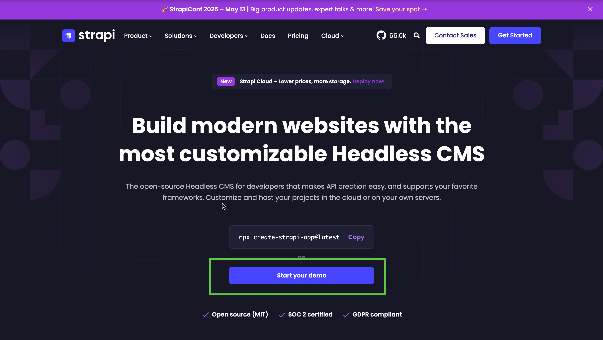

This will allow to request a demo account to test both the Strapi backend and the Next.js frontend.

You can watch the following video to see how to request a demo account:

[Watch the video](https://www.youtube.com/watch?v=wQ0b8dx6tEw)

But in this tutorial, I will show you how to setup the project locally, then deploy it to Vercel and Strapi Cloud.

## Setup the project locally

### Clone the repository

```bash
git clone https://github.com/PaulBratslavsky/LaunchPad.git launchpad
```

Once the repository is cloned, change directory to the project folder:

```bash
cd launchpad
```

You can install the dependencies by running the following command in the project root folder:

```bash
yarn setup
```

This will install the dependencies and copy the `.env.example` file to `.env`.

Now let's seed the database with the following command:

```bash
yarn seed
```

This will seed the database with the default data.

You can now start the project by running the following command:

```bash
yarn dev
```

This will start the Next.js frontend and the Strapi backend.

You can now access the website at `http://localhost:3000`.

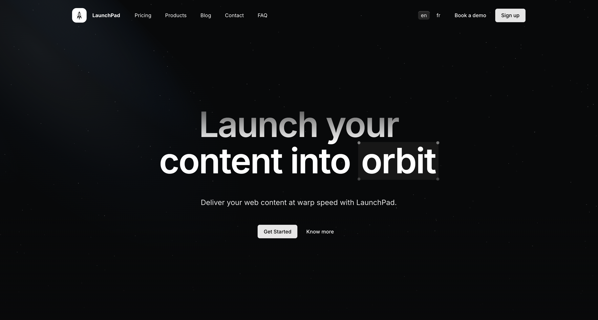

And the Strapi admin at `http://localhost:1337`.

Because we are starting Strapi for the first time, you will need to create an admin user.

You should see the following screen:

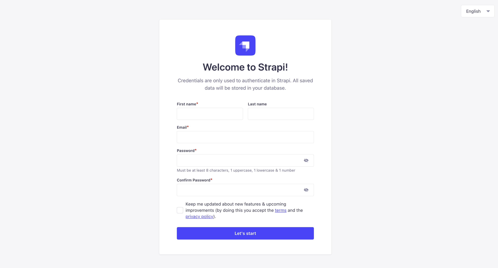

Once logged in, you will be greeted with the admin dashboard. You can click on the **Content Manager** button and select **Article** content type and you should see all your articles.

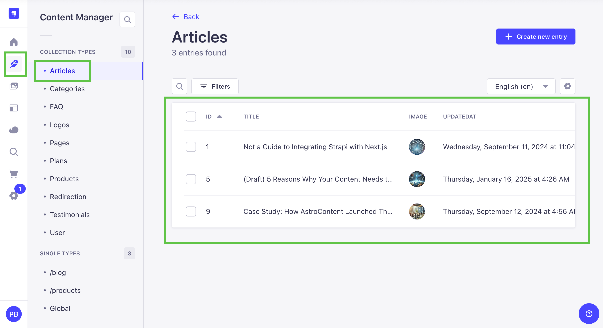

Feel free to explore the rest of the admin dashboard.

## Setting up the Preview Functionality

Now let's setup the preview functionality.

Let's navigate to one of our articles and click on the **Preview** button.

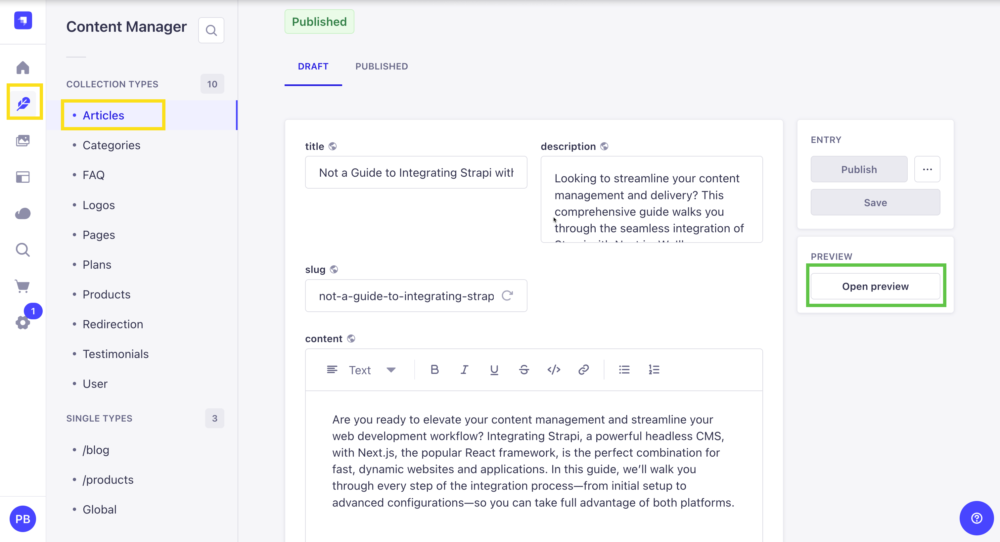

You should see the following screen:

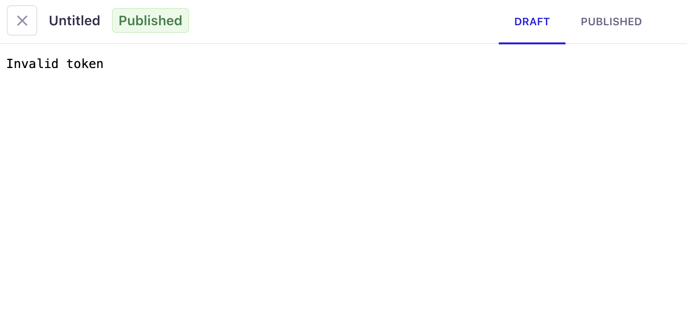

Notice that we have invalid token error. We need to make sure that we add the appropriate token to the `.env` file found both in the Strapi backend folder and the Next.js frontend folder.

Let's first navigate to `next/.env` and make sure that the following variables are set:

```
WEBSITE_URL=http://localhost:3000 # Add the correct ENV var for this onto your hosting platform, point it to your production website.
PORT=3000

NEXT_PUBLIC_API_URL=http://localhost:1337
PREVIEW_SECRET=set-the-same-random-token-as-for-strapi-and-next
```

Note: when deploying to Vercel, you will need to add the correct ENV vars for these variables.

Now let's navigate to `strapi/.env` and make sure that the following variables are set:

```
STRAPI_ADMIN_CLIENT_URL=http://localhost:3000
STRAPI_ADMIN_CLIENT_PREVIEW_SECRET=set-the-same-random-token-as-for-strapi-and-next

CLIENT_URL=http://localhost:3000
PREVIEW_SECRET=your-secret-key # optional, required with Next.js draft mode
```

Now restart both the Next.js frontend and the Strapi backend.

Now let's navigate to the article again and click on the **Preview** button. You should see the following screen:

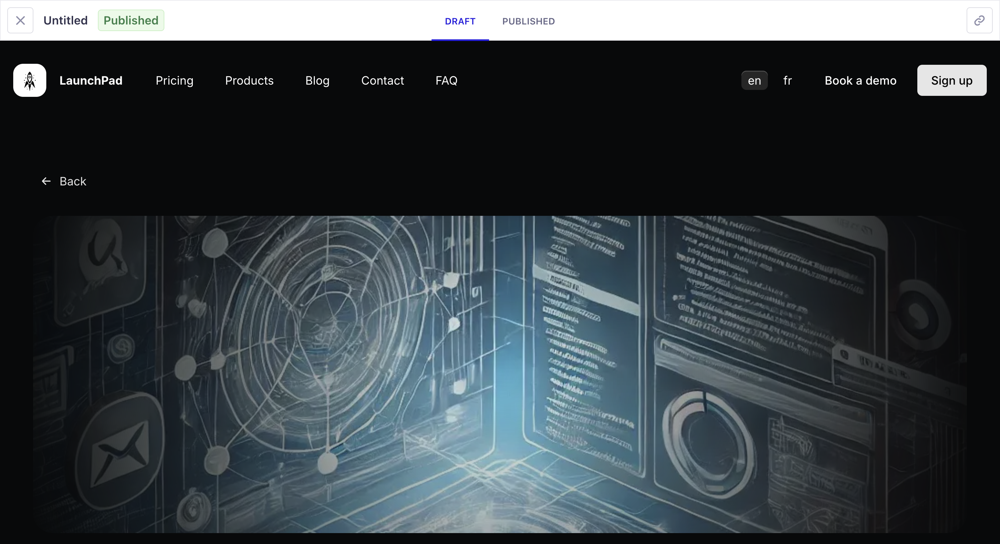

Nice, not that we have our application working locally. Let's now take a look at how to deploy it to Strapi Cloud and Vercel.

## Deploying Our Strapi Project to Strapi Cloud and Vercel

### Prerequisites

- Your code pushed to your own GitHub repository
- Created a [Strapi Cloud](https://strapi.io/cloud) account ( you can sign up via GitHub )
- Have a [Vercel](https://vercel.com) account

### Deploying to Strapi Cloud

Once you have your code pushed to GitHub, and created a Strapi Cloud account, you can deploy your project to Strapi Cloud by following these steps:

First, login into your Strapi Cloud account, you may be asked which provider you want to connect to.

I will be using GitHub, so I will click on the **GitHub** button.

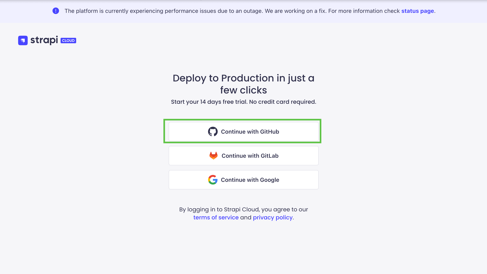

Once signed in, we will start by clicking on the **Create new project** button.

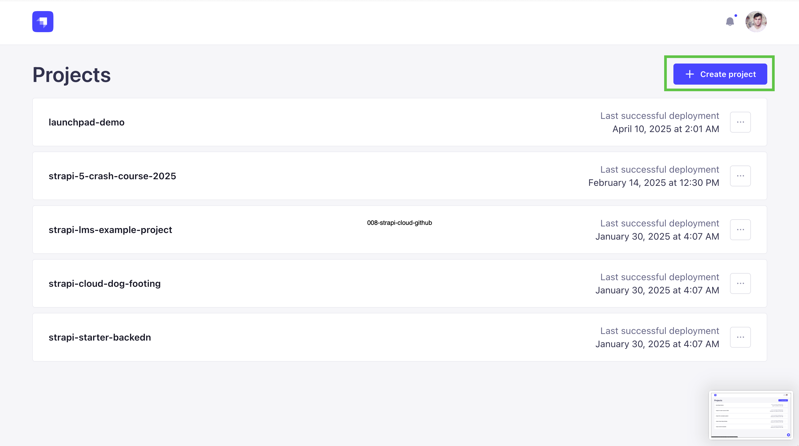

We are going to choose the **FREE PLAN** that allows you to try out Strapi Cloud for free for 14 days.

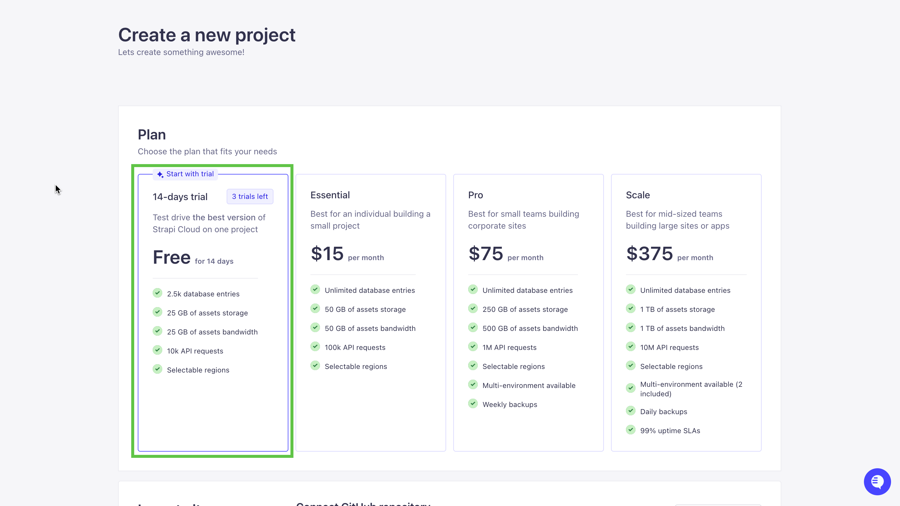

Next, we will need to choose the repository we want to deploy from. Go ahead and select your project repository.

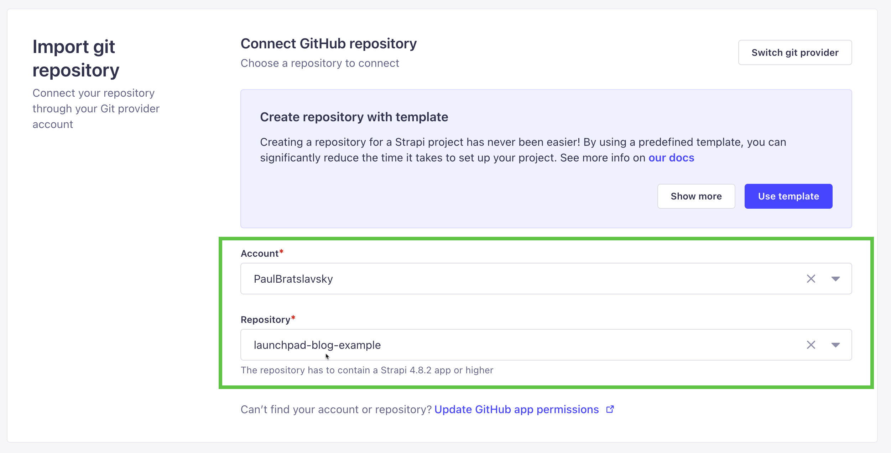

Give your project a name, for example `launchpad-demo` then choose the region that is closest to you. I am going to choose **New York | USA** region.

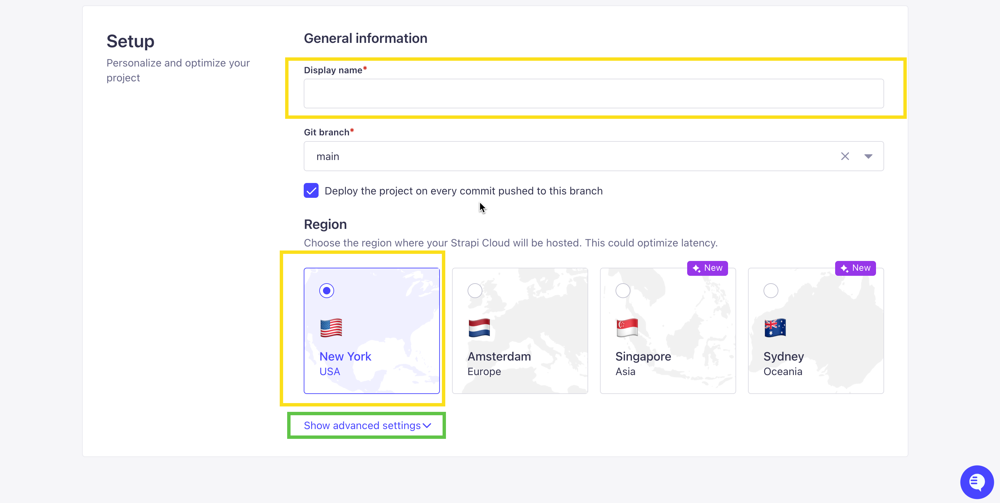

Next let's click on **Show Advanced Settings** button and update the base directory to `strapi` since this is the folder containing the Strapi project.

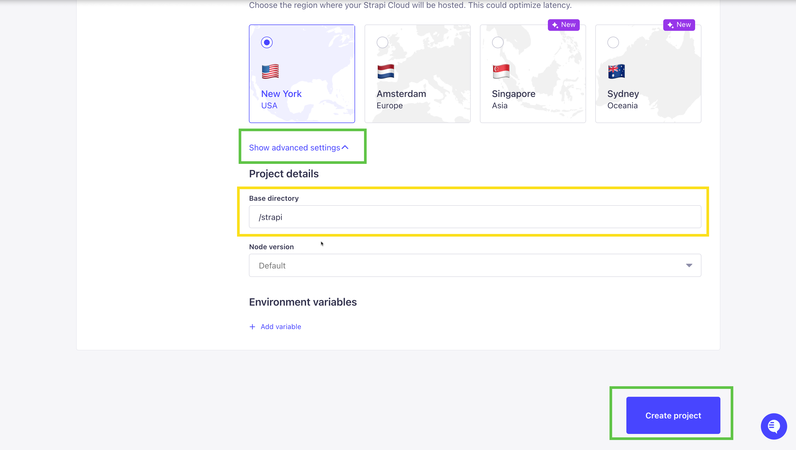

Next, let's click on the **Create project** button to deploy our project.

Note: we will come back later to update our `environment variables` after we deploy our Next.js frontend to Vercel.

You will see the project creation screen followed by the deployment progress.

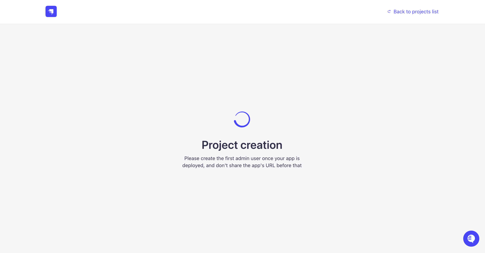

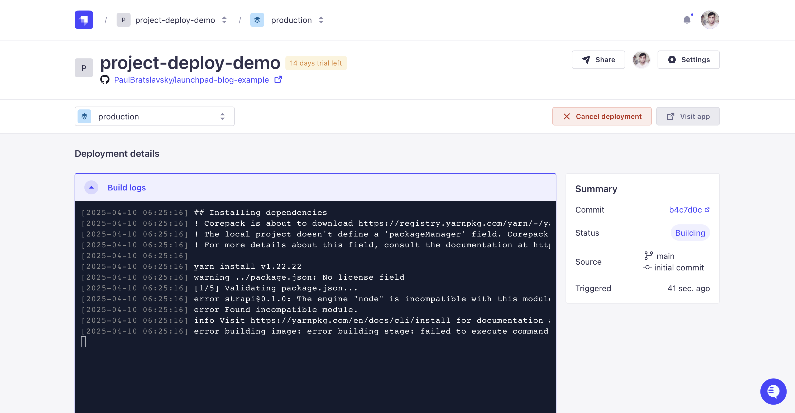

Once your project is deployed, you will be able to visit your project by clicking on the **Visit** button.

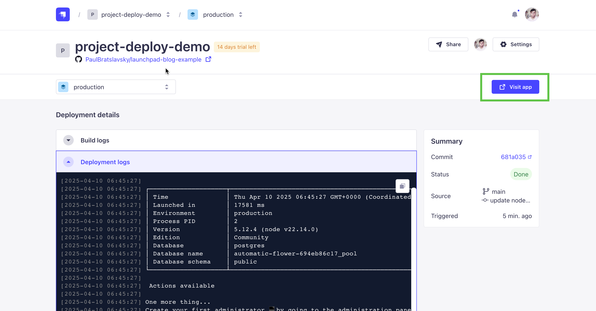

You will be redirected to create your Strapi admin user.

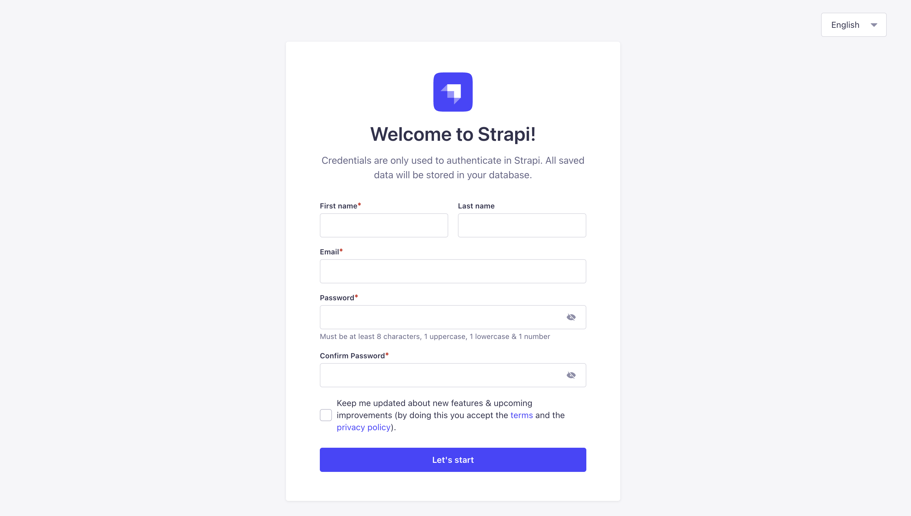

Once you login, you will be redirected to the project dashboard. Let's navigate to our article content type. You will see that we don't have any articles yet.

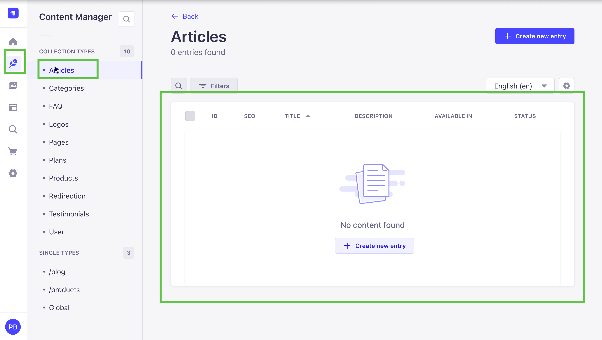

Let's use the **Transfer** feature to transfer our local date to our deployed Strapi Instance.

Navigate to **Settings** => **Token Transfer** and click on the **Create new Transfer Token** button.

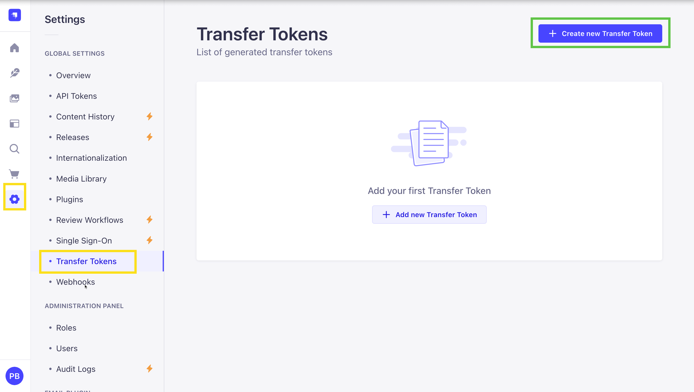

Now let's create our first transfer token. You can call it whatever you like, for duration I will choose **7 days** and toke type will be **Full Access**. Finally, click on the **Save** button.

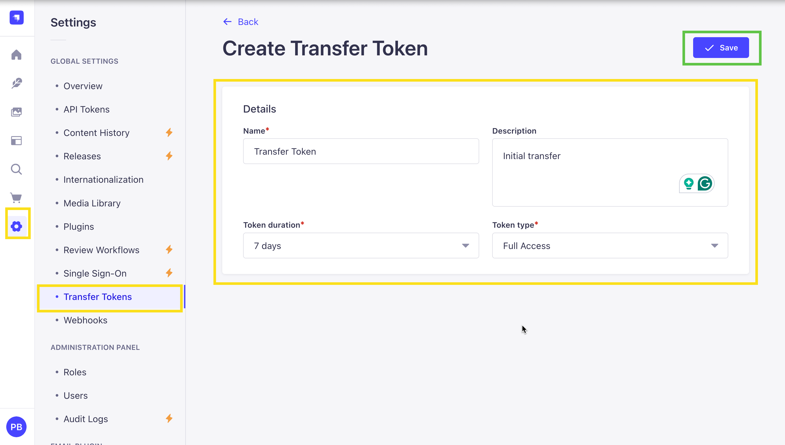

You should now see the following screen:


Now that we have our token, we can use it to transfer our local data to our deployed Strapi Instance.

In your local instance running on your machine, navigate to `strapi` folder and run the following command:

```bash
yarn strapi transfer --to your_strapi_cloud_instance_url/admin
```

In my case my command was:

```bash
yarn strapi transfer --to https://automatic-flower-694eb86c17.strapiapp.com/admin
```

Make sure to include the `/admin` at the end of your Strapi Cloud instance URL.

Finally, you will be prompted to paste in your transfer token.

```bash
yarn run v1.22.22
warning ../package.json: No license field
$ strapi transfer --to https://automatic-flower-694eb86c17.strapiapp.com/admin
? Please enter your transfer token for the remote Strapi destination [input is hidden]

```

Paste in your transfer token and press **Enter**.

You will see the following message:

```bash
? The transfer will delete existing data from the remote Strapi! Are you sure you want to
 proceed? (y/N)
```

Type **y** and press **Enter**.

You will see the following message:

```bash
Starting transfer...
✔ entities: 191 transfered (size: 210.7 KB) (elapsed: 6773 ms) (31.1 KB/s)
✔ assets: 115 transfered (size: 22.8 MB) (elapsed: 53526 ms) (436 KB/s)
✔ links: 637 transfered (size: 114.4 KB) (elapsed: 1786 ms) (64 KB/s)
✔ configuration: 71 transfered (size: 183.8 KB) (elapsed: 1608 ms) (114.3 KB/s)
┌─────────────────────────────────────────┬───────┬───────────────┐
│ Type                                    │ Count │ Size          │
├─────────────────────────────────────────┼───────┼───────────────┤
│ entities                                │   191 │     210.7 KB  │
├─────────────────────────────────────────┼───────┼───────────────┤
│ -- api::article.article                 │    12 │ (      76 KB) │
├─────────────────────────────────────────┼───────┼───────────────┤
│ -- api::blog-page.blog-page             │     2 │ (     1.4 KB) │
├─────────────────────────────────────────┼───────┼───────────────┤
│ -- api::category.category               │     9 │ (     2.1 KB) │
├─────────────────────────────────────────┼───────┼───────────────┤
│ -- api::faq.faq                         │    14 │ (     6.7 KB) │
├─────────────────────────────────────────┼───────┼───────────────┤
│ -- api::global.global                   │     4 │ (       9 KB) │
├─────────────────────────────────────────┼───────┼───────────────┤
│ -- api::logo.logo                       │    16 │ (     3.7 KB) │
├─────────────────────────────────────────┼───────┼───────────────┤
│ -- api::page.page                       │    16 │ (    34.4 KB) │
├─────────────────────────────────────────┼───────┼───────────────┤
│ -- api::plan.plan                       │     8 │ (     5.6 KB) │
├─────────────────────────────────────────┼───────┼───────────────┤
│ -- api::product-page.product-page       │     2 │ (     1.5 KB) │
├─────────────────────────────────────────┼───────┼───────────────┤
│ -- api::product.product                 │    10 │ (     7.6 KB) │
├─────────────────────────────────────────┼───────┼───────────────┤
│ -- api::redirection.redirection         │     4 │ (       1 KB) │
├─────────────────────────────────────────┼───────┼───────────────┤
│ -- api::testimonial.testimonial         │    14 │ (     6.4 KB) │
├─────────────────────────────────────────┼───────┼───────────────┤
│ -- plugin::i18n.locale                  │     2 │ (     505 B ) │
├─────────────────────────────────────────┼───────┼───────────────┤
│ -- plugin::upload.file                  │    43 │ (    45.2 KB) │
├─────────────────────────────────────────┼───────┼───────────────┤
│ -- plugin::upload.folder                │     3 │ (     783 B ) │
├─────────────────────────────────────────┼───────┼───────────────┤
│ -- plugin::users-permissions.permission │    30 │ (     8.2 KB) │
├─────────────────────────────────────────┼───────┼───────────────┤
│ -- plugin::users-permissions.role       │     2 │ (     656 B ) │
├─────────────────────────────────────────┼───────┼───────────────┤
│ assets                                  │   115 │      22.8 MB  │
├─────────────────────────────────────────┼───────┼───────────────┤
│ -- .jpeg                                │     7 │ (    35.4 KB) │
├─────────────────────────────────────────┼───────┼───────────────┤
│ -- .jpg                                 │    36 │ (   502.1 KB) │
├─────────────────────────────────────────┼───────┼───────────────┤
│ -- .png                                 │    50 │ (    20.6 MB) │
├─────────────────────────────────────────┼───────┼───────────────┤
│ -- .svg                                 │     7 │ (    21.3 KB) │
├─────────────────────────────────────────┼───────┼───────────────┤
│ -- .webp                                │    15 │ (     1.6 MB) │
├─────────────────────────────────────────┼───────┼───────────────┤
│ links                                   │   637 │     114.4 KB  │
├─────────────────────────────────────────┼───────┼───────────────┤
│ configuration                           │    71 │     183.8 KB  │
├─────────────────────────────────────────┼───────┼───────────────┤
│ Total                                   │  1014 │      23.3 MB  │
└─────────────────────────────────────────┴───────┴───────────────┘
Transfer process has been completed successfully!
✨  Done in 147.63s.
```

Now that our transfer is complete, let's navigate to our Strapi Cloud project and see if our articles are there.

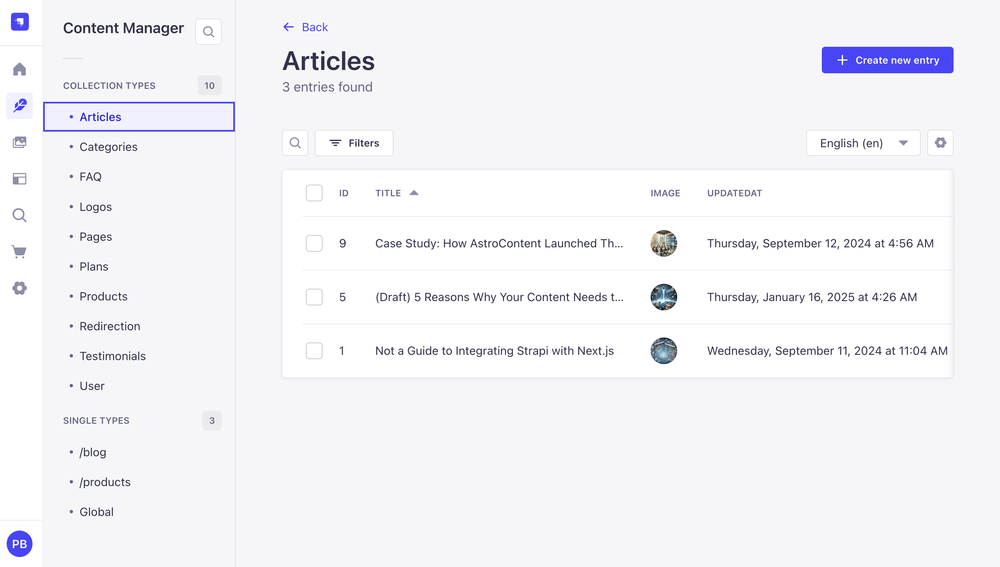

You will see that our articles are there.

Nice, now that our Strapi Project is deployed to Strapi Cloud, let's deploy our Next.js frontend to Vercel.

### Deploying to Vercel

If you don't have a Vercel account, let's go and create one.

Navigate to the following [link here](https://vercel.com) and click the "Sign Up" button to get started.

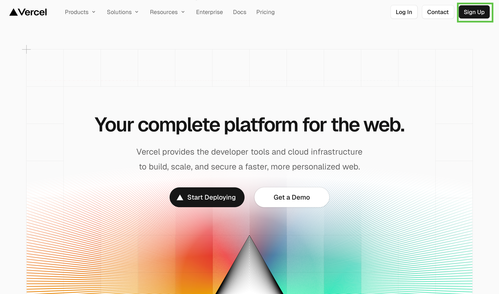

Once you have a Vercel account, let's navigate to the Vercel dashboard and click on the **Add New** button and select **Project** 

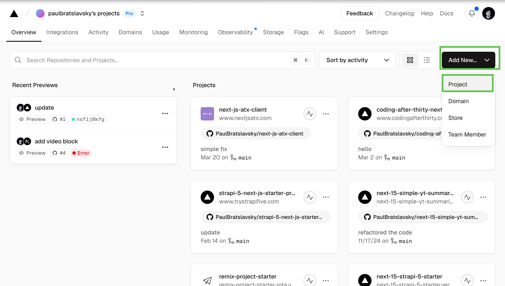

Now let's connect our GitHub repository and select our project repository.

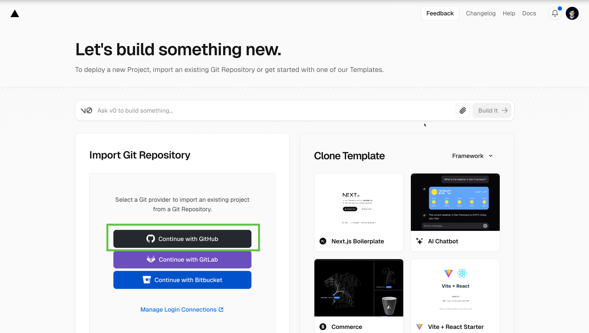

I am going to select my repo that I am using for this blog post. But you should select the repo that you want to deploy.

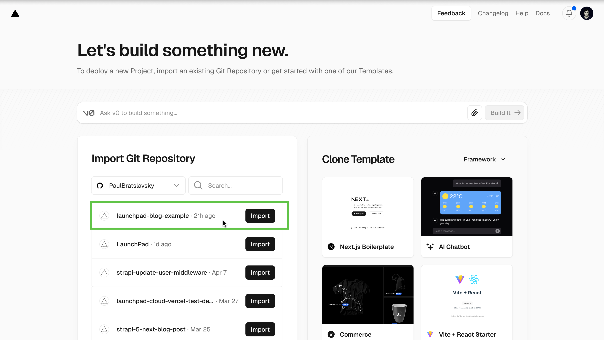

Now let's click **Edit** button to edit the project root directory.

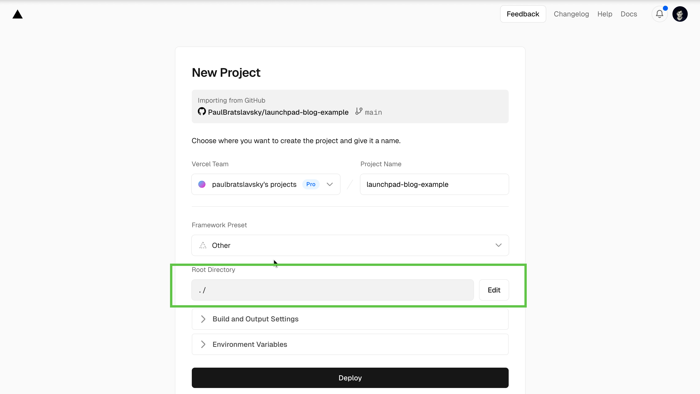

Select the `next` folder as the project root directory and click on the **Continue** button. Since this is where our Next.js project is located.

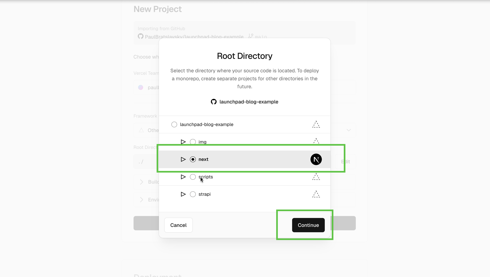

We now have to add our environment variables. 

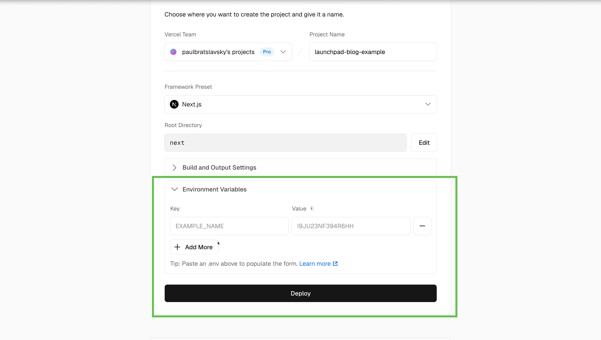

We will add the following environment variables:

- `NEXT_PUBLIC_API_URL`: the URL of your Strapi Cloud instance
- `IMAGE_HOSTNAME`: the URL of your Strapi Cloud Media Storage
- `PREVIEW_SECRET`: the key for the preview secret

**NEXT_PUBLIC_API_URL**
This is the URL of your Strapi Cloud instance. In my case it is `https://automatic-flower-694eb86c17.strapiapp.com`.

You can find it in your Strapi Cloud project dashboard.

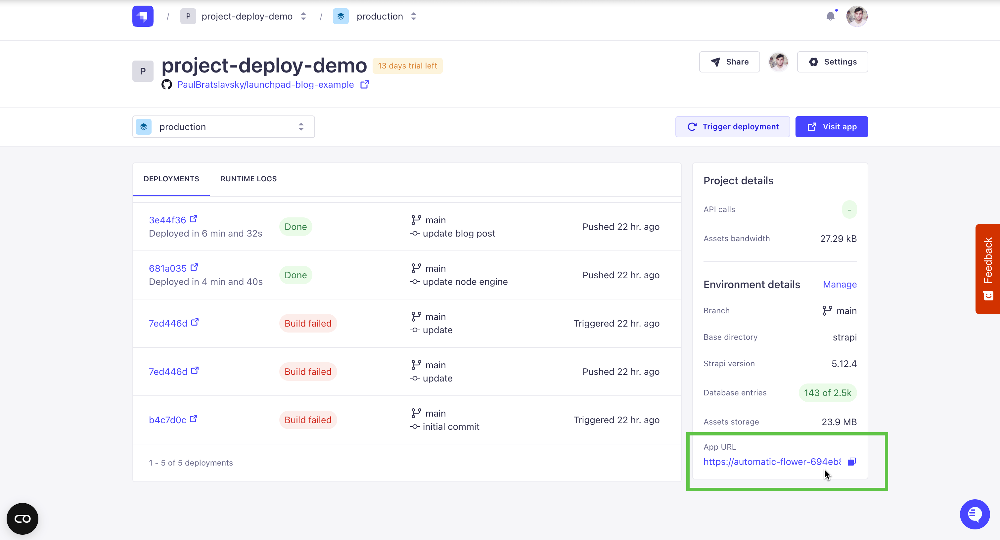

Note: when copy the link, you can remove the `/admin` at the end of the URL.

**IMAGE_HOSTNAME**
The easiest way to get the `IMAGE_HOSTNAME` is inside your Strapi Cloud project in the **Media Library** section. Select any image and click on the **Copy URL** button.

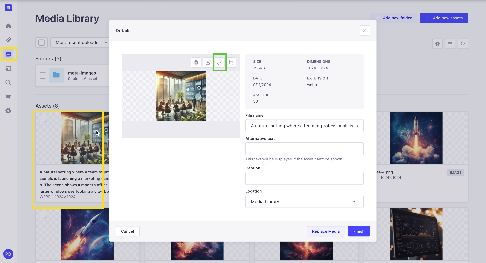

You will get a URL like this:

```
https://automatic-flower-694eb86c17.media.strapiapp.com/A_natural_setting_where_a_team_of_professionals_is_launching_a_marketing_campaign_The_scene_shows_a_modern_office_with_large_windows_overlooking_a_ci_165bacb7dd.webp
```

In this case, the `IMAGE_HOSTNAME` is `automatic-flower-694eb86c17.media.strapiapp.com`.

The naming convention for the `IMAGE_HOSTNAME` is `{your-project-name}.media.strapiapp.com`.


**PREVIEW_SECRET**
For the `PREVIEW_SECRET`, you can use any random string. I will use `preview-secret`.

Just make sure to use the same secret key in both the Next.js frontend and the Strapi backend.

Which we will update in the next steps.

Now let's click on the **Deploy** button.

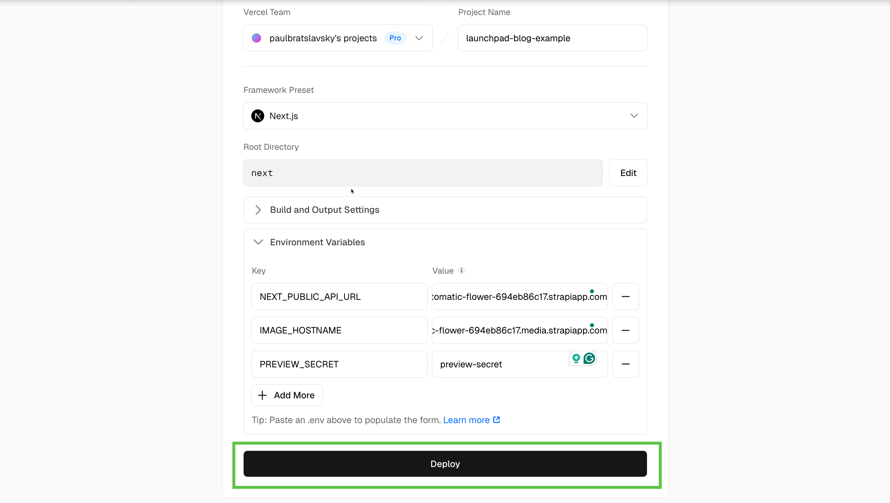

Once the deployment is complete, you should see the following screen:

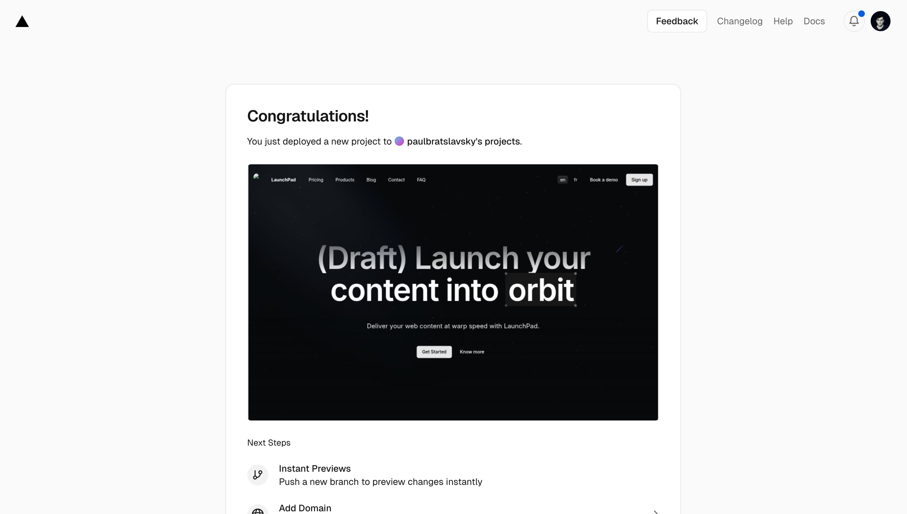

You can click on **Continue to Dashboard** to go to your Vercel dashboard.

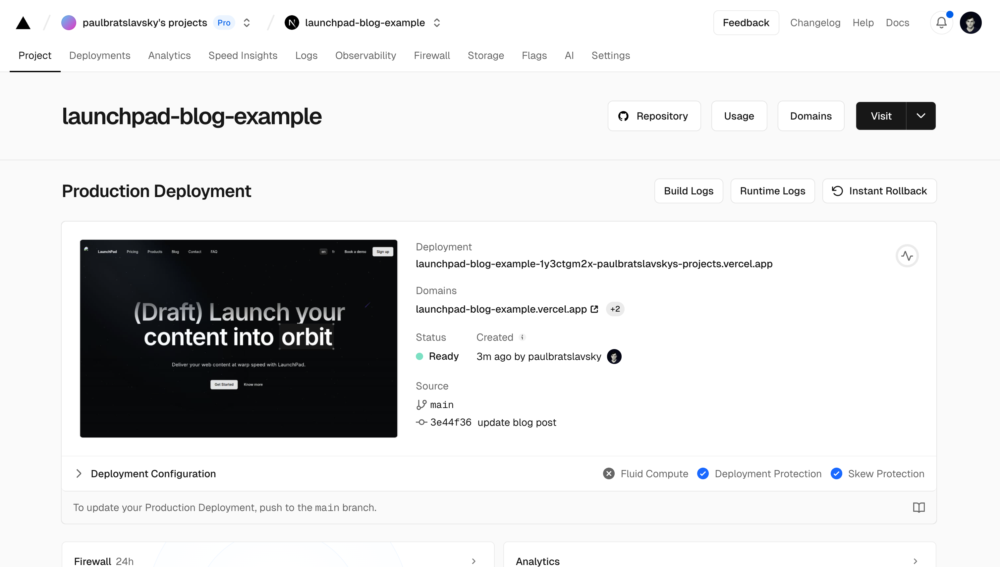

You can click on the **Visit** to navigate to your website.

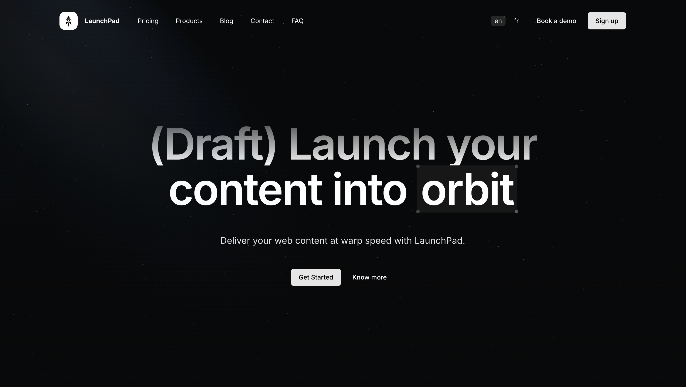

Nice. Now that we have our Next.js frontend deployed to Vercel, let's update our Strapi Cloud project with the correct environment variables to enable the preview functionality.

### Enable Preview Functionality in Strapi Cloud Production

If we navigate to our Strapi Cloud project, select and **Article** content type and click on the **Preview** button, we will get the following error:

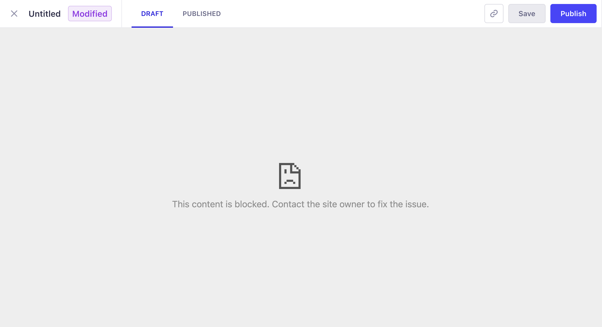

This is because we don't have the correct environment variables set in our Strapi Cloud project.

Let's navigate to the **Settings** => **Variables** section and click on the **Add Variable** button.

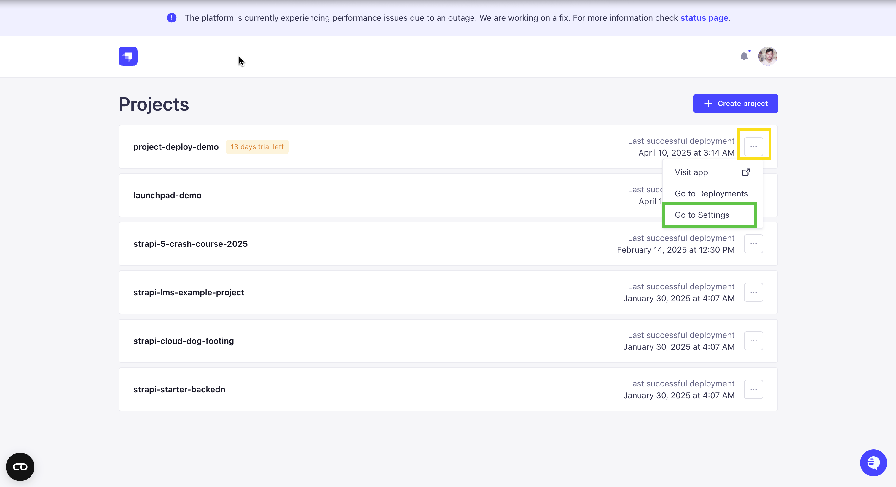

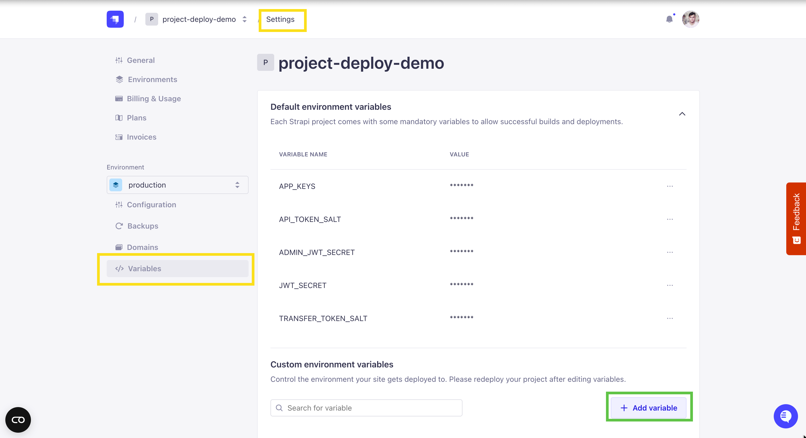


We will add the following variables:

- `STRAPI_ADMIN_CLIENT_URL`: the URL of your Vercel Next.js frontend  
- `STRAPI_ADMIN_CLIENT_PREVIEW_SECRET`: the key for the preview secret
- `CLIENT_URL`: the URL of your Vercel Next.js frontend
- `PREVIEW_SECRET`: this is optional, required with Next.js draft mode (not something we are using in this example)

**STRAPI_ADMIN_CLIENT_URL** and **CLIENT_URL**
These are the URLs of your Vercel Next.js frontend. In my case it is `https://launchpad-blog-example.vercel.app`.

**STRAPI_ADMIN_CLIENT_PREVIEW_SECRET**
This is the key for the preview secret. I will use `preview-secret`.

Once you add the required variables, go ahead and click on the **Save** button.

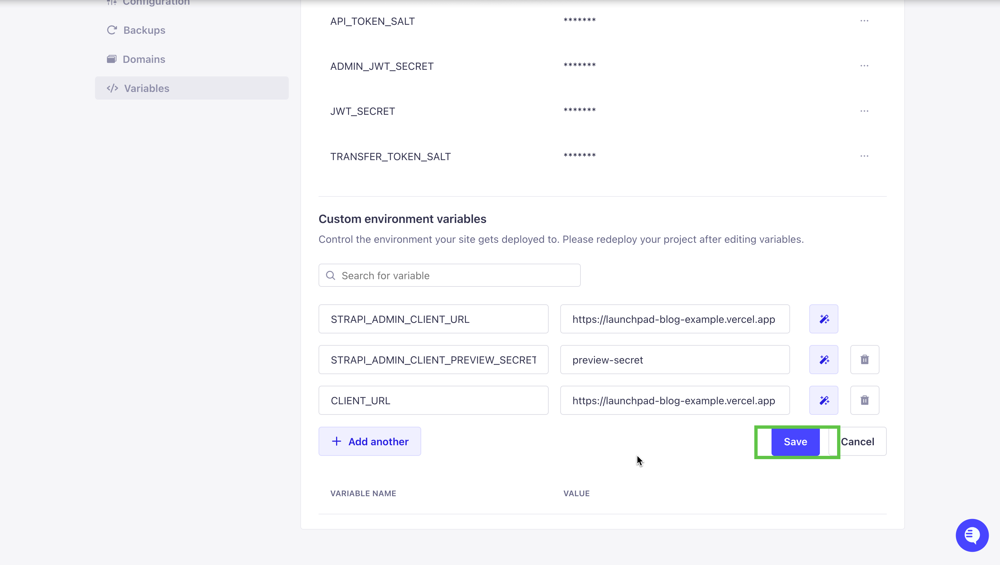

Finally, in our project dashboard we need to click on the **Trigger deployment** button to apply the changes.

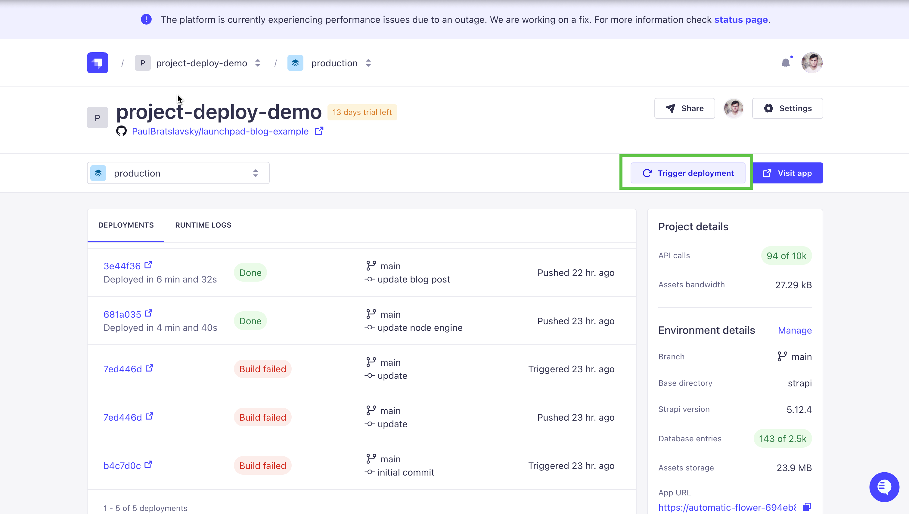

Now let's navigate to our Strapi Cloud project, select and **Article** content type and click on the **Preview** button and should see that the preview functionality is working.


Nice. We have successfully deployed Strapi and Next.js Launchpad project.

## Conclusion

We covered how to explore the Launchpad demo, set up the project on your local machine, configure preview functionality, and deploy both the Strapi backend to Strapi Cloud and the Next.js frontend to Vercel.

I hope you enjoyed this tutorial and if you have any questions, please feel free to reach out to me.


