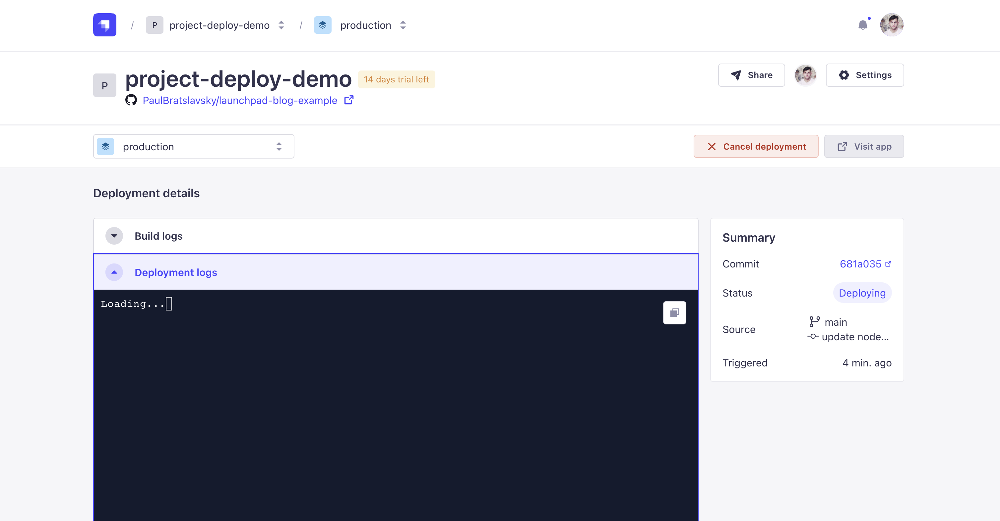

# Getting Started with Launchpad Official Next.js and Strapi Starter

## Introduction

This is a guide to help you get started with the Launchpad Official Next.js and Strapi Starter.


Launchpad Official Next.js and Strapi Starter is a starter project that allows you to quickly start building a website with Next.js and Strapi.

## Try it out without any coding

You can try it out without any coding by clicking on the link below:

[Try it out](https://launchpad-official-nextjs-and-strapi-starter.vercel.app/)


This will allow to request a demo account to test both the Strapi backend and the Next.js frontend.

You can watch the following video to see how to request a demo account:

[Watch the video](https://www.youtube.com/watch?v=wQ0b8dx6tEw)

But in this tutorial, I will show you how to setup the project locally, then deploy it to Vercel and Strapi Cloud.

## Setup the project locally

### Clone the repository

```bash
git clone https://github.com/PaulBratslavsky/LaunchPad.git launchpad
```

Once the repository is cloned, change directory to the project folder:

```bash
cd launchpad
```

You can install the dependencies by running the following command in the project root folder:

```bash
yarn setup 
```

This will install the dependencies and copy the `.env.example` file to `.env`.

Now let's seed the database with the following command:

```bash
yarn seed
```

This will seed the database with the default data.

You can now start the project by running the following command:

```bash
yarn dev
```

This will start the Next.js frontend and the Strapi backend.

You can now access the website at `http://localhost:3000`.


And the Strapi admin at `http://localhost:1337`.

Because we are starting Strapi for the first time, you will need to create an admin user.

You should see the following screen:


Once logged in, you will be greeted with the admin dashboard. You can click on the **Content Manager** button and select **Article** content type and you should see all your articles.


Feel free to explore the rest of the admin dashboard.

## Setting up the Preview Functionality

Now let's setup the preview functionality.

Let's navigate to one of our articles and click on the **Preview** button.


You should see the following screen:


Notice that we have invalid token error.  We need to make sure that we add the appropriate token to the `.env` file found both in the Strapi backend folder and the Next.js frontend folder.


Let's first navigate to `next/.env` and make sure that the following variables are set:

```
WEBSITE_URL=http://localhost:3000 # Add the correct ENV var for this onto your hosting platform, point it to your production website.
PORT=3000

NEXT_PUBLIC_API_URL=http://localhost:1337
PREVIEW_SECRET=set-the-same-random-token-as-for-strapi-and-next
```

Note: when deploying to Vercel, you will need to add the correct ENV vars for these variables.

Now let's navigate to `strapi/.env` and make sure that the following variables are set:

```
STRAPI_ADMIN_CLIENT_URL=http://localhost:3000
STRAPI_ADMIN_CLIENT_PREVIEW_SECRET=set-the-same-random-token-as-for-strapi-and-next

CLIENT_URL=http://localhost:3000
PREVIEW_SECRET=your-secret-key # optional, required with Next.js draft mode
```

Now restart both the Next.js frontend and the Strapi backend.

Now let's navigate to the article again and click on the **Preview** button. You should see the following screen:


Nice, not that we have our application working locally. Let's now take a look at how to deploy it to Strapi Cloud and Vercel.

## Deploying Our Strapi Project to Strapi Cloud and Vercel

### Prerequisites

- Your code pushed to GitHub
- Created a [Strapi Cloud](https://strapi.io/cloud) account ( you can sign up via GitHub )
- Have a [Vercel](https://vercel.com) account


### Deploying to Strapi Cloud

Once you have your code pushed to GitHub, and created a Strapi Cloud account, you can deploy your project to Strapi Cloud by following these steps:

First, login into your Strapi Cloud account, you may be asked which provider you want to connect to.

I will be using GitHub, so I will click on the **GitHub** button.


Once signed in, we will start by clicking on the **Create new project** button.


We are going to choose the **FREE PLAN** that allows you to try out Strapi Cloud for free for 14 days.


Next, we will need to choose the repository we want to deploy from. Go ahead and select your project repository.


Give your project a name, for example `launchpad-demo` then choose the region that is closest to you. I am going to choose **New York | USA** region.


Next let's click on **Show Advanced Settings** button and update the base directory to `strapi` since this is the folder containing the Strapi project.


Next, let's click on the **Create project** button to deploy our project.

Note: we will come back later to update our `environment variables` after we deploy our Next.js frontend to Vercel.

You will see the project creation screen followed by the deployment progress.




Once your project is deployed, you will be able to visit your project by clicking on the **Visit** button.


You will be redirected to the project dashboard.


1. Go to [Strapi Cloud](https://strapi.io/cloud)
2. Click on the **Connect** button
3. Select **GitHub**
4. Select the repository you want to deploy
5. Click on the **Deploy** button


